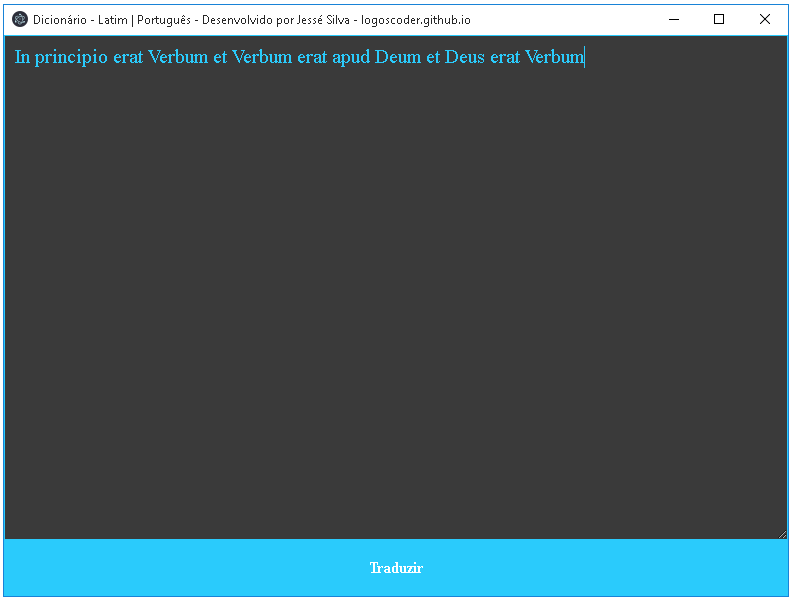
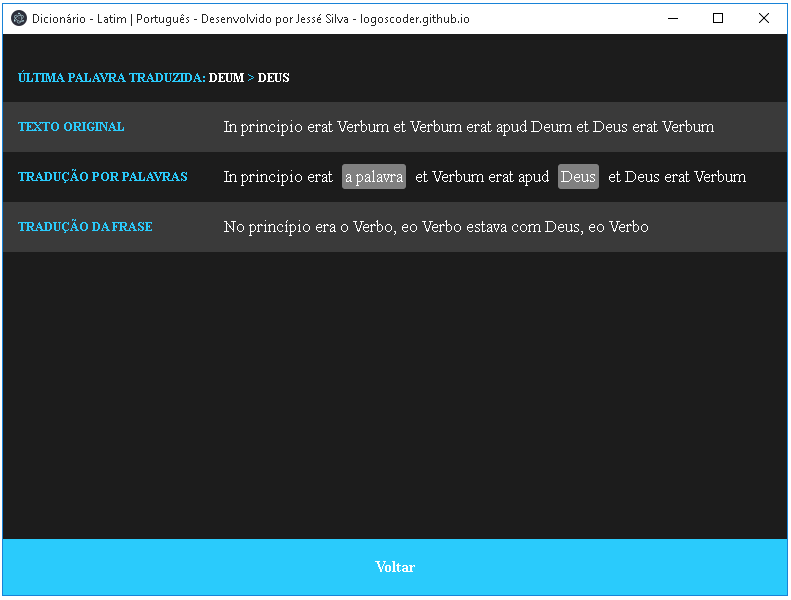
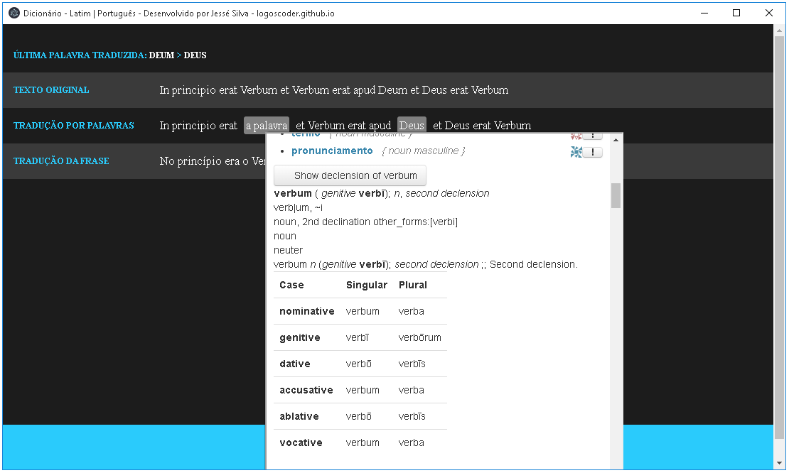

# Dicionário Latim | Português

Vem me despertando um certo interesse pelo Latim, creio eu pela influência de alguns amigos, bem como a curiosidade em ler obras mais antigas como a dos escolásticos e particularmente de Filósofos como Santo Tomás de Aquino.

Devido a isso desenvolvi um dicionário simples para me auxiliar nos estudos e nas traduções. Confesso que havia feito para uso próprio, mas decidi tornar público para compartilhar com meus amigos. E para isso criei um instalador para Windows, bastando baixar o mesmo e instalar em seu computador.

Para usá-lo (após instalá-lo), basta abrir o mesmo e digitar a frase ou palavra que deseja traduzir e clicar no botão azul chamado "Traduzir" (procurei deixar bem simplificado e intuitivo).

Após clicar em "Traduzir" aparecerá três colunas, uma com o texto original, uma com a possibilidade de traduzir as palavras isoladamente, e outra com a frase inteira traduzida.

Observe que na coluna do meio está destacada duas palavras, elas ficam assim e traduzidas quando se clica sobre elas.

Além disso, após clicar em traduzir a palavra isoladamente, ao passar o mouse sobre a palavra abrirá uma janela com o site do glosbe.com (muito obrigado a meu amigo Henrique pela recomendação do site), no mesmo aparece detalhes das palavras em Latim, como declinações, etc.

### Autor

* **Jessé Silva** - aka - *logoscoder* - [logoscoder.github.io](https://logoscoder.github.io)