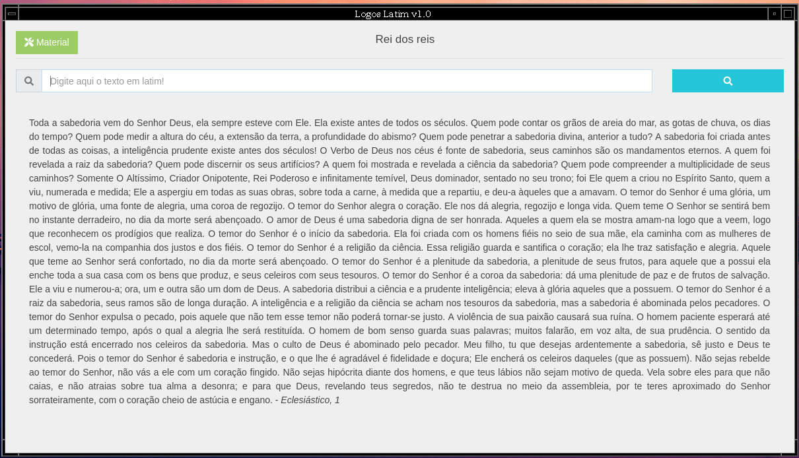

# Logos Latim - Dicionário Latim | Português

Vem me despertando um certo interesse pelo Latim, creio eu pela influência de alguns amigos, bem como a curiosidade em ler obras mais antigas como a dos escolásticos e particularmente de Filósofos como Santo Tomás de Aquino.

Devido a isso desenvolvi um dicionário simples para me auxiliar nos estudos e nas traduções. Confesso que havia feito para uso próprio, mas decidi tornar público para compartilhar com meus amigos. Ele funciona tanto no Windows quanto no Linux (e também Mac com algumas modificações, bastando baixar o pacote do electron para Mac).

### Autor

* **Jessé Silva** - aka - *logoscoder* - [logoscoder.github.io](https://logoscoder.github.io)